# Architecture Decision Record: Use ADRs

[![Decided on][octicon-calendar]][adr-0001]
<time datetime="2019-03-08">2019-03-08</time>

## Status

[![adr: accepted][adr-accepted-badge]][adr-0001]

## Context

The **archetypes-rules** team has several explicit goals that make the practice
and discipline of architecture very important:

-   We want to think deeply about all our architectural decisions, exploring all
    alternatives and making a careful, considered, well-researched choice.

-   We want to be as transparent as possible in our decision-making process.

-   We don't want decisions to be made unilaterally in a vacuum. Specifically,
    should **archetypes-rules** ever fall under the purview of a Technical
    Steering Committee (TSC), we would want to give our TSC colleagues the
    opportunity to review every major decision.

-   Despite being a geographically and temporally distributed team, we want our
    contributors to have a strong shared understanding of the technical rationale
    behind decisions.

-   We want to be able to revisit prior decisions to determine fairly whether they
    still make sense, and if the motivating circumstances or conditions have
    changed.

## Decision

We will document every architecture-level decision for **archetypes-rules** and
its core modules with an Architecture Decision Record. These are a well
structured, relatively lightweight way to capture architectural proposals. They
can serve as an artifact for discussion, and remain as an enduring record of the
context and motivation of past decisions.

### Our Workflow for Making and Recording Architecture Decisions[^1]

```mermaid
graph TD

subgraph ADR Workflow

title["ℹ️  High-level flow chart showing how we distribute design authority with architecture decision records"]
title-->A
style title fill:#FFF,stroke:#FFF
linkStyle 0 stroke:#FFF,stroke-width:0;

  A(("start")) --> B(Significant requirement, challenge, or change)
  B --> C("Create GitLab Issue (with the ADR Template)")
  C --> D("Field Comments and Discussions")
  D --> E("Vote (lazy consensus)")
  E --> F{"Tally 👍  👎  reactions"}
  F --> |"👍 majority 'accepted'"| G("Apply badge 'ADR accepted'")
  F --> |"👎 majority 'rejected'"| H("Apply badge 'ADR rejected'")
  G --> I
  H --> I("Merge ADR into `master`")
  I --> J(("stop"))
end
```

1.  A contributor creates an ADR document outlining an approach for a particular
    question or problem. All ADRs have an initial status of "proposed."
    Maintainers and Trusted Committers must apply the <kbd>adr: proposed</kbd>
    Issue label.

1.  We track architecture decisions on the "[ADR (Architecture Decision
    Records)][adr-issue-board]" Issue Board.

1.  The Maintainer, Trusted Committer, Contributors, and Consumers consider the
    ADR through _public_ GitLab Discussions. These GitLab Discussions must be
    resolved by (lazy) consensus.

1.  During the discussion period, the ADR should be updated to reflect
    additional context, concerns raised, and proposed changes. Maintainers and
    Trusted Committers must apply the <kbd>adr: discussion-underway</kbd> label
    the associated Issue or Pull Request.

1.  Once consensus is reached, the ADR will be marked as either an "accepted" or
    "rejected". The Maintainer or Trusted Committer must likewise apply the
    label "adr: accepted" or "adr: rejected" to the original issue.

1.  The Maintainer or Trusted Committer will also update the **"Status"**
    section of the ADR with the badge that reflects the ADR's state.[^2] \(The
    Style Guide for Images has
    ["how-to" instructions for badges](https://github.com/archetypes-rules/signatures/wikis/Style-Guides/Images).)

1.  Only after an ADR is accepted should implementing code be committed to the
    `master` branch of a relevant application, library, or module.

1.  All ADRs should be merged into the `master` branch, no matter what their
    ultimate status is.

1.  If a decision is revisited and a different conclusion is reached, a new ADR
    should be created documenting the context and rationale for the change. The
    new ADR should reference the old one, and once the new one is accepted, the
    old one should (in its "status" section) be updated to point to the new one.
    The old ADR should not be removed or otherwise modified except for the
    annotation pointing to the new ADR.

## Consequences

1.  Contributors must write an ADR and submit it for review before selecting an
    approach to any architectural decision; that is, any decision that affects
    the way **archetypes-rules** or an **archetypes-rules** application is put
    together at a high level.

1.  We will have a concrete artifact around which to focus discussion, before
    finalizing decisions.

1.  If we follow the process, decisions will be made deliberately, as a group.

1.  The master branch of our repositories will reflect the high-level consensus
    of the steering group.

1.  We will have a useful persistent record of why the system is the way it is.

## References

[^1]: Swindle, G. (2019) _Architecture Decisions · Wiki ·
  archetypes-rules/signatures · GitLab_. Retrieved March 08, 2019, from
  <https://github.com/archetypes-rules/signatures/wikis/Governance/Architecture-Decisions>

[^2] Swindle, G. (2019) _Images · Wiki · archetypes-rules/signatures · GitLab_.
  Retrieved March 08, 2019, from
  <https://github.com/archetypes-rules/signatures/wikis/Style-Guides/Images>

<!-- Do not remove this line or anything under it. -->

[adr-0001]: docs/adr/adr-0001-architecture-decision-record-use-adrs.md

[adr-issue-board]: https://github.com/archetypes-rules/signatures/boards/980468?&label_name[]=type%3A%20adr

[adr-accepted-badge]: https://flat.badgen.net/badge/ADR/accepted/44AD8E

[adr-proposed-badge]: https://flat.badgen.net/badge/ADR/proposed/AC900D

[adr-rejected-badge]: https://flat.badgen.net/badge/ADR/rejected/D9534F

[adr-deprecated-badge]: https://flat.badgen.net/badge/ADR/deprecated/7F8C8D

<!-- Octicon image definition list -->

[octicon-calendar]: https://cdnjs.cloudflare.com/ajax/libs/octicons/8.3.0/svg/calendar.svg
